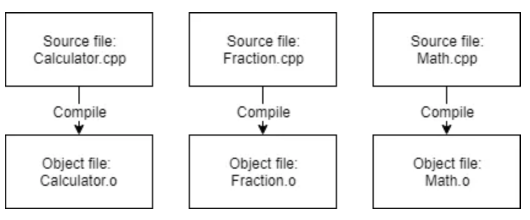
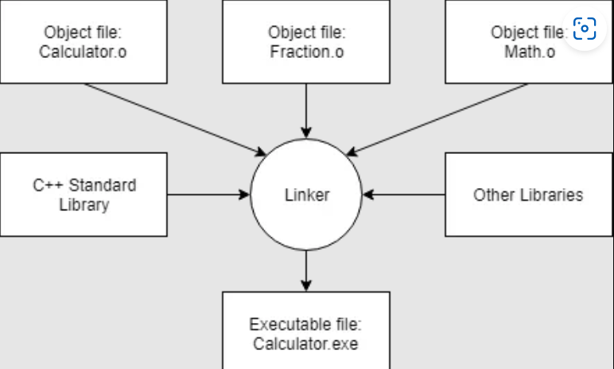

# CSD215 Programming Language Project


# C++ Programming Language

## History
C++ is a general-purpose programming language created by Bjarne Stroustrup as an extension of the C programming language, or "C with Classes". 

The language has evolved greatly over time, and contemporary C++ currently contains facilities for low-level memory management along with object-oriented, generic, and functional features.

There are numerous vendors who offer C++ compilers, and it is virtually always implemented as a compiled language.

C++ was influenced by the following languages: C, Simula, ALGOL 68, Ada, ML, CLU, and Smalltalk.

This language also has been influential in the design of other languages such as C#, D, Java, and JavaScript.

## Focus

In addition to offering tools for low-level memory manipulation, C++ contains imperative, object-oriented, and generic programming features.

Some of the key features of C++ include:
* Dinamically memmory allocation
* Templates
* Operator overloading
* Multiple inheritance
* Virtual functions
* Namespaces
* Pointers

C++ allows memory to be allocated at runtime, which provides a lot of flexibility, but also introduces the possibility of memory leaks and other memory management issues.

## Compilation

C++ is a compiled language. This means that the source code is translated into machine code by a compiler before it can be executed.

The compiler is responsible for:
* Checking the syntax of the source code
* Checking the semantics of the source code
* Translating the source code into machine code (object file)


Source: https://www.learncpp.com/cpp-tutorial/introduction-to-the-compiler-linker-and-libraries/

In addition, it is usually necessary to link the compiled code with other libraries and object files to produce an executable program, which a linker is used to do.

The linker is responsible for:
* Combining multiple object files into a single executable
* Linking the executable with libraries
* Ensuring cross-file references are resolved 


Source: https://www.learncpp.com/cpp-tutorial/introduction-to-the-compiler-linker-and-libraries/

C++ programs are usually structured into source files and header files. The source files contain the actual code, while the header files contain declarations of functions, classes, and other entities that are used in the source files.

## Paradigms

C++ is a multi-paradigm language. This means that it supports multiple programming styles, including procedural, object-oriented, generic, and functional programming.
However, C++ is primarily an object-oriented language, and it is often used to implement object-oriented designs.

## Syntax

This is the simplest way to write a "Hello World" in C++:

```cpp
#include <iostream>

int main() {
    std::cout << "Hello World!" << std::endl;
    return 0;
}
```

C++ is statically typed, therefore the type of the variable must be declared before it is used. The syntax for declaring a variable is:

```cpp
type variable_name;

int x {0};
char c[1] = {'a'};
const float PADDLE_SPEED = 1.0f;
std::string name {"John Doe"};
```
Variables can be initialized with a value when they are declared (values are declared in the curly braces or using the assign operator), or they can be initialized later. However, it is strngly recommended to initialize variables when they are declared, otherwise they will contain garbage values.

### <u>Namespaces</u>

Namespaces are used to organize code into logical groups and to prevent name collisions that can occur especially when your code base includes multiple libraries.

The most common namespace is the `std` namespace, which contains all of the standard library functions.

```cpp
#include <iostream>

using namespace std;

int main() {
    cout << "No need the std:: notation" << endl;
    return 0;
}
``` 

### <u>Loops</u>

`For Loops`:

```cpp
for (initialization; conditional; increment) {
    //do stuff
}

//Example
for (int i = 0; i < 5; i++) {
    std::cout << i << std::endl;
}
//Output:
//0
//1
//2
//3
//4
```
`Range-Based For Loops`:

```cpp
for (declaration : expression) {
    //do stuff
}

//Example
int arr[] = {1, 2, 3, 4, 5};
for (int i : arr) {
    std::cout << i << std::endl;
}
```

`Endless For Loop`:

Although this is not a good practice, it is possible to create an endless loop using the for loop. In this case, all the expressions are omitted.

```cpp
for (;;) {
    //do stuff
}
//Example
int i = 0;
for (;;) {
    std::cout << i << std::endl;
    i++;
    if (i == 5) {
        break;
    }
}
```

`While Loops`:

```cpp

while (conditional) {
    //do stuff
}
//Example
int i = 0;
while (i < 5) {
    std::cout << i << std::endl;
    i++;
}
//Output:
//0
//1
//2
//3
//4
```
`Do-While Loops`:
In this type of loop, the conditional is checked after the loop body is executed, that is, the loop body is always executed at least once.

```cpp
do {
    //do stuff
} while (conditional);

//Example
int i = 0;
do {
    std::cout << i << std::endl;
    i++;
} while (i < 5);
//Output:
//0
//1
//2
//3
//4
```
### <u>Switch Statement</u>

The switch statement is used to select one of many code blocks to be executed.

```cpp
switch (expression) {
    case constant-expression  :
       statement(s);
       break; // optional
    case constant-expression  :
       statement(s);
       break; // optional
    // you can have any number of case statements.
    default : // Optional
       statement(s);
}
//Example from Pong clone game
if (event.type == SDL_KEYDOWN)
    {
        switch (event.key.keysym.sym) {
        case SDLK_ESCAPE:
            running = false;
            break;
        case SDLK_w:
            buttons[Buttons::PaddleOneUp] = true;
            break;
        case SDLK_s:
            buttons[Buttons::PaddleOneDown] = true;
            break;
        case SDLK_UP:
            buttons[Buttons::PaddleTwoUp] = true;
            break;
        case SDLK_DOWN:
            buttons[Buttons::PaddleTwoDown] = true;
            break;
        }
    }   
```

### <u>Functions</u>

Functions are declared in the header file and defined in the source file.
The function header contains the return type, the name of the function, and the parameters.

```cpp
//header file
//Just the function header, no body
int add(int x, int y);
void print(int x);

//source file
//Function implementation
int add(int x, int y) {
    return x + y;
}

void print(int x) {
    std::cout << x << std::endl;
}
```

### <u>Conditionals</u>

`If Statement`:

```cpp
if (conditional) {
    //do stuff
}
//Example
int x = 5;
if (x > 0) {
    std::cout << "x is positive" << std::endl;
}
//Output:
//x is positive
```
`If-Else Statement`:

```cpp
if (conditional) {
    //do stuff
} else {
    //do other stuff
}
//Example
int x = -1;
if (x > 0) {
    std::cout << "x is positive" << std::endl;
} else {
    std::cout << "x is negative" << std::endl;
}
//Output:
//x is negative
```
`If-Else If-Else Statement`:

```cpp
if (conditional) {
    //do stuff
} else if (conditional) {
    //do other stuff
} else {
    //do other stuff
}
//Example
int x = 0;
if (x > 0) {
    std::cout << "x is positive" << std::endl;
} else if (x < 0) {
    std::cout << "x is negative" << std::endl;
} else {
    std::cout << "x is zero" << std::endl;
}
//Output:
//x is zero
```

### <u>Pointers</u>

A raw pointer is a variable that stores the memory address of another variable. It is declared using the asterisk (\*) symbol.

```cpp
int x = 5;
int* ptr = &x;
```

The ampersand (\&) symbol is used to get the memory address of a variable.

```cpp
int x = 5;
int* ptr = &x;
std::cout << ptr << std::endl;
//Output:
//0x7ffeeb5b9f7c
```

The asterisk (\*) symbol is used to get the value of a pointer.

```cpp
int x = 5;
int* ptr = &x;
std::cout << *ptr << std::endl;
//Output:
//5
```
When using raw pointers in C++, it is important to remember to delete the pointer after it is no longer needed. This is because raw pointers do not have any automatic garbage collection mechanism.

```cpp
int* ptr = new int;
delete ptr;
```

### <u>Smart Pointers</u>

Smart pointers are a type of pointer that automatically deletes the pointer when it is no longer needed. 
Smart pointers can be:
* Unique 
* Shared 
* Weak 

#### <u>Unique Pointers</u>

Unique pointers are a type of smart pointer that can only have one owner. They are declared using the `std::unique_ptr` template.

```cpp
std::unique_ptr<int> ptr = std::make_unique<int>(5);
```
Unique pointers are the most commonly used smart pointers in C++.

#### <u>Shared Pointers</u>

Shared pointers are a type of smart pointer that can have multiple owners. They are declared using the `std::shared_ptr` template.

```cpp
std::shared_ptr<int> ptr = std::make_shared<int>(5);
```

#### <u>Weak Pointers</u>

Weak pointers are a type of smart pointer that can have multiple owners but does not increase the reference count. They are declared using the `std::weak_ptr` template.

```cpp
std::weak_ptr<int> ptr = std::make_shared<int>(5);
```
### <u>Arrays</u>

Arrays are a type of data structure that stores a collection of elements of the same type. They are declared using the square brackets (\[\]) symbol.

```cpp
int arr[5];
```

Elements can be accessed using the square brackets (\[\]) symbol.

```cpp
int arr[5];
arr[0] = 5;
```

Arrays have a fixed size nad hence, cannot grow or shrink in size. Moreover, arrays in C++ do not have bound checks, which means that accessing an element outside the bounds of the array will result in undefined behavior.

### <u>Vectors</u>

Vectors are a type of dynamic array, which means that they can grow and shrink in size. They are declared using the `std::vector` template.

```cpp
std::vector<int> vec;
```

As opposed to arrays, vectors also have bound checks, which means that accessing an element outside the bounds of the vector will result in an exception.
They are similar to the list data structure in other languages.


### <u>Classes</u>

C++ also features Classes and Objects. Classes are declared using the `class` keyword.
The following example shows how to declare a class.

```cpp
class PlayerScore
{
private: 
    SDL_Renderer* renderer = nullptr;
    TTF_Font* font = nullptr;
    SDL_Surface* surface= nullptr;
    SDL_Texture* texture = nullptr;
    SDL_Rect rect{};
    int textWidth{ 0 }, textHeight{ 0 };

public:
    //Constructor
    PlayerScore(Vec2 position, SDL_Renderer* renderer, TTF_Font* font)
	   : renderer(renderer), font(font)
    {
	   surface = TTF_RenderText_Solid(font, "0", { 0, 0xFF, 0, 0xFF });
	   texture = SDL_CreateTextureFromSurface(renderer, surface);

	   
	   SDL_QueryTexture(texture, nullptr, nullptr, &textWidth, &textHeight);

	   rect.x = static_cast<int>(position.x);
	   rect.y = static_cast<int>(position.y);
	   rect.w = textWidth;
	   rect.h = textHeight;
    }
    //Destructor
    ~PlayerScore()
    {
	   SDL_FreeSurface(surface);
	   SDL_DestroyTexture(texture);
    }

    //Function definition
    void Draw();
    void SetScore(int score);
};
```
In C++, classes are often declared in header files, which are then included in the source files. The following example shows how to include a header file.

```cpp
#include "PlayerScore.h"
```
### <u>Structs</u>

Structs are similar to classes, but they are declared using the `struct` keyword. They are often used to represent data structures.

```cpp
struct Vec2
{
    float x, y;
};
```
In a struct declaration, all members are public by default.

## <u>Functions</u>

### <u>Function Prototypes</u>

Function prototypes are used to declare a function before it is defined. It only contains the function name, the return type, and the parameters. No body is included in the function prototype.

```cpp
void Print(int x);
```

### <u>First-class Functions</u>

 C++ features first-class functions also. Functions can be passed as arguments to other functions, returned from other functions, and assigned to variables.

```cpp
void Print(int x)
{
    std::cout << x << std::endl;
}

int main()
{
    void (*func)(int) = Print;
    func(5);

    return 0;
}
```
### <u>Lambda Expressions</u>

C++ also features lambda expressions, which are anonymous functions that can be passed as arguments to other functions.
Syntax:

```cpp
[Capture](Parameters) -> Return Type { Body }
```
Capture is a way to capture variables from the enclosing scope. There are three common types of capture:

* `[]` - No capture
* `[x]` - Capture by value
* `[&x]` - Capture by reference

The following example shows how to use lambda expressions:

```cpp
int main()
{
    auto func = [](int x) { std::cout << x << std::endl; };
    func(5);

    return 0;
}
```

### <u>Closure</u>
C++ Closures are also supported, which means that functions can capture variables from the enclosing scope.

```cpp
int main()
{
    int x = 5;
    auto func = [x]() { std::cout << x << std::endl; };
    func();

    return 0;
}
```
### <u>Currying</u>

Currying is also supported in C++.
```cpp
int main()
{
    auto func = [](int x) { return [x](int y) { return x + y; }; };
    auto add5 = func(5);
    std::cout << add5(5) << std::endl;

    return 0;
}
```

### <u>Virtual Functions</u>

Virtual functions are functions declared in a parent (base) class, that can be overridden in a child (derived) class.
The `virtual` keyword is used to declare a function as virtual, and the `override` keyword is used to override a virtual function.

```cpp

```cpp
class Base
{
public:
    virtual void Print() { std::cout << "Base" << std::endl; }
};

class Derived : public Base
{
public:
    void Print() override { std::cout << "Derived" << std::endl; }
};

```
## Type System

As mentioned before, C++ is a statically typed language. It is arguiably considered a strongly typed language, as it does not allow implicit type conversions. However, it does allow explicit type conversions.

C++ has the following type classes:

* Primitive types
* Derived types
* Reference types
* Pointer types
* Array types
* Class types
* Enum types

### <u>The "auto" Keyword</u>

The `auto` keyword can be used to automatically deduce the type of a variable. It is useful when the type of a variable is not known at compile time.
A very common use case is when iterating over a container.

```cpp
std::vector<int> vec = { 1, 2, 3, 4, 5 };
for (auto x : vec)
{
    std::cout << x << std::endl;
}
```

### <u>The "sizeof" Operator</u>

The `sizeof` operator can be used to get the size of a type in bytes.

```cpp
std::cout << sizeof(int) << std::endl;
//Output: 4
```
In most cases, the size of a type is the same on all platforms. However, this may vary depending on the platform.

## Data Mutability

In C++, variables are passed by value by default, which means that they are copied when passed to a function, that is, the value of the original variable is not changed.
However, it is possible to pass variables by reference, which means that the variable is a reference to the original value address in memory, and hence it can change the original value.
When a value is passed by reference, the variable is prefixed with an ampersand (&).

```cpp
//Pass by value
void add(int x, int y) {
    x = x + y;
}

//Pass by reference
void add(int &x, int y) {
    x = x + y;
}
```

## Memory Management

C++ has a garbage collector, which means that memory is automatically freed when it is no longer needed. However, it is possible to manually free memory using the `delete` keyword.

```cpp
int* x = new int(5);
delete x;
```

## Operator Overloading

C++ supports operator overloading, which means that operators can be overloaded to work with user-defined types.

```cpp
struct Vec2
{
    float x, y;

    Vec2 operator*(float rhs)
    {
	   return Vec2(x * rhs, y * rhs);
    }
};
```
## The Standard Tamplate Library (STL)

The Standard Template Library (STL) is a collection of generic data structures and algorithms. It is a part of the C++ standard library, and is included by default in every C++ program.
It is a very powerful tool, and is used in almost every C++ program.

Elements of the STL:
* Containers
    * Collections of objects or primitive types.
    * Examples: array, vector, deque, map, set, etc.
* Iterators
    * Used to iterate over containers.
    * Examples: forward, reverse, bidirectional, random access
* Algorithms
    * Functions that operate on containers.
    * Examples: sort, find, count, etc.


