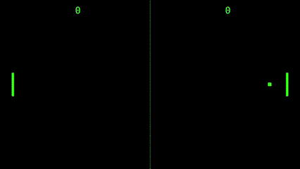
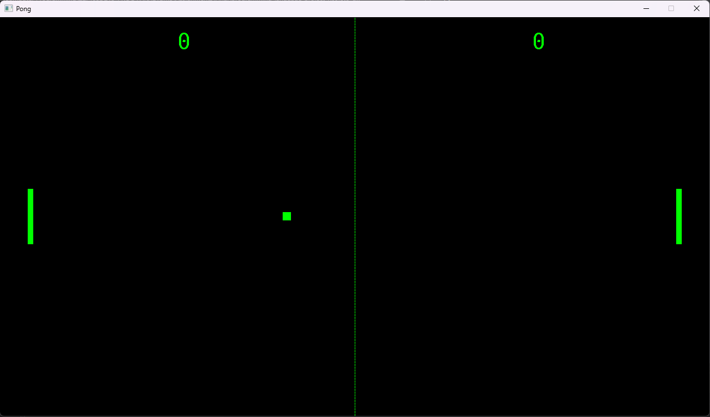
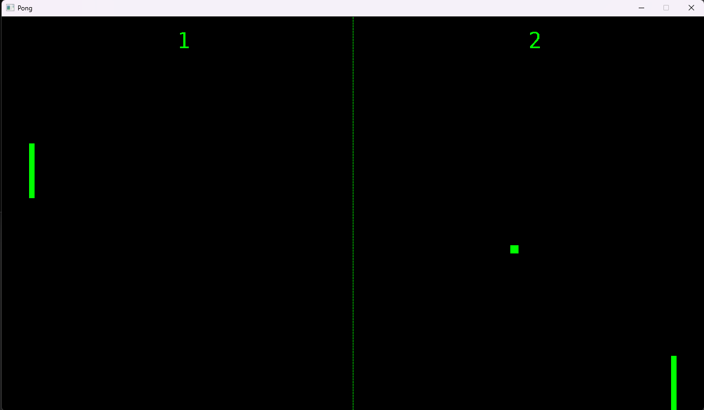

# A Pong Clone Game

To celebrate the 50th aniversary of the Pong game, I decided to make a clone of it in C++. The game is a two player game, where each player controls a paddle and tries to hit the ball past the other player's paddle. At the current level of implementation, the game runs continuounsly until the "ESC" key is pressed or the window is closed. The game is played on a 1280x720 window.



## How to play

The game is played with the "W" and "S" keys for the left paddle and the "Up" and "Down" arrow keys for the right paddle.
To exit the game, press the "ESC" key, or close the window.

## How to run
Open the PongClone.sln file on Visual Studio 2019 or later, and press F5.
The main code is in the Game.cpp file. Please make sure to set the VS debugger to x64.
If you have any issues running the game, it is possible that you need to update the PATH variable to include the used libraries.

Go to your Environment Variables on Windows and add the following to the System  variable PATH:

**local-repo-location\src\SDL2_ttf-2.20.1\lib\x64**

**local-repo-location\src\SDL2_mixer-2.6.2\lib\x64**

**local-repo-location\src\SDL2-2.24.0\lib\x64**

## The Game Structure
As a typical C++ application, the game is structured in source files and header files, that are linked together to form the executable. The main source file is the Game.cpp file, which contains the main function and the main game loop.
Each object of the game is represented by a class, which is defined in a header file and implemented in a source file. The classes are organized in the following way:

<ul>
    <li>Header files:</li>
    <ul>
        <li>Vec2.h</li>
        <li>Ball.h</li>
        <li>Paddle.h</li>
        <li>PlayerScore.h</li>
        <li>Contact.h</li>
    </ul>
    <li>Source files:</li>
    <ul>
        <li>Vec2.cpp</li>
        <li>Ball.cpp</li>
        <li>Paddle.cpp</li>
        <li>PlayerScore.cpp</li>
        <li>Game.cpp</li> 
    </ul>
</ul>

In C++, usually the header files contain the class definition and the source files contain the class implementation. However, in this case, the Contact class simple defines a collision type, so it is defined and implemented in the same file.

To create the graphic elements of the game, I used the Simple DirectMedia Layer (SDL) library. The SDL library is a cross-platform library that provides a simple API to create windows, render graphics, handle inputs, play sounds, etc. The SDL library is used in many games, such as the Super Mario Bros. game.

## The Vec2 Class

The Vec2 class defines a 2D vector, which is used to represent the the x and y coordinates of objects in the game, such as the ball and the paddles. The class is defined in the Vec2.h file and implemented in the Vec2.cpp file.

A typical Vec2 object constructor is defined as follows:

```cpp
// Constructor
Vec2(float x, float y)
	: x(x), y(y) {}
```

The main purpose of this helper class is to provide a simple way to represent a 2D vector, and to provide some basic operations on vectors, such as addition and multiplication. This is class is also used to represent attributes of the game objects, such as the position and velocity.

To accomplish this, I made use of the C++ operator overloading feature. For example, the following code defines the behavior of the "+" operator for the Vec2 class:

```cpp
 // Operators overload
Vec2 operator+(Vec2 const& rhs)
{
    return Vec2(x + rhs.x, y + rhs.y);
}
```
Another C++ feature that is present in this class is the ability to include "friend" classes, functions or operators in a class. The friend declaration is made in the Vec2.h file and the implementation is made in the Vec2.cpp file. In this class, the insertion operator is declared as a friend, so it can be overloaded to print the Vec2 object to the console:

```cpp
//In the Vec2.h file, the insertion operator from the ostream library is declared as a friend.
class Vec2
{
    friend std::ostream &operator<<(std::ostream& os, const Vec2& obj);
    ...
    ...
};
```

```cpp
//In the Vec2.cpp file the operator behavior is defined when there is a Vec2 object on the right side of the operator.
std::ostream &operator<<(std::ostream &os, const Vec2& obj)
{
    os << "x: " << obj.x << " y: " << obj.y;
    return os;
}
```

## The Ball Class

The Ball class defines the ball object, which is the main object of the game. The class is defined in the Ball.h file and implemented in the Ball.cpp file.

To keep the game math simple, a ball is represented by a rectangle shape that consists of a position, a velocity, a width and a height. The position and velocity are represented by a Vec2 object, and the rectangle is a SDL_Rect object.

```cpp
// Ball constructor
Ball(int ball_height, int ball_width, Vec2 position, Vec2 velocity)
	   : position(position), velocity(velocity)
    {
	   rect.x = static_cast<int>(position.x);
	   rect.y = static_cast<int>(position.y);
	   rect.w = ball_width;
	   rect.h = ball_height;
    }

```
The Ball class also has the ability to draw itself on the screen, using a SDL renderer, update its position and check for collisions with other objects or walls (the screen edges). The following code shows the declaration of the functions that are used to draw, update and check for collisions:

```cpp
// Draws the ball on the screen  
void Ball::Draw(SDL_Renderer* renderer)
{
    rect.x = static_cast<int>(position.x);
    rect.y = static_cast<int>(position.y);
    SDL_RenderFillRect(renderer, &rect);
}

// Updates the ball position based on the velocity and the time elapsed since the last update
void Ball::Update(float dt)
{
    position += velocity * dt;
}

// Checks for collisions with the paddles
void Ball::CollideWithPaddle(Contact const& contact, const float ball_speed)
{
    position.x += contact.penetration;
    velocity.x = -velocity.x;

    if (contact.type == CollisionType::Top)
    {
	   velocity.y = -.75f * ball_speed;
    }
    else if (contact.type == CollisionType::Bottom)
    {
	   velocity.y = 0.75f * ball_speed;
    }
}

// Checks for collisions with the walls (screen edges)
void Ball::CollideWithWall(Contact const& contact, const int window_width, const int window_height, const float ball_speed)
{
    if ((contact.type == CollisionType::Top)
	   || (contact.type == CollisionType::Bottom))
    {
	   position.y += contact.penetration;
	   velocity.y = -velocity.y;
    }
    else if (contact.type == CollisionType::Left)
    {
	   position.x = window_width / 2.0f;
	   position.y = window_height / 2.0f;
	   velocity.x = ball_speed;
	   velocity.y = 0.75f * ball_speed;
    }
    else if (contact.type == CollisionType::Right)
    {
	   position.x = window_width / 2.0f;
	   position.y = window_height / 2.0f;
	   velocity.x = -ball_speed;
	   velocity.y = 0.75f * ball_speed;
    }
}
```

## The Paddle Class

The Paddle class defines the paddle object, which is used by the players to hit the ball. The class is defined in the Paddle.h file and implemented in the Paddle.cpp file.

A paddle is represented by a rectangle shape that consists of a position, a velocity, a width and a height. The position and velocity are represented by a Vec2 object, and the rectangle is a SDL_Rect object.

```cpp
// Paddle constructor
Paddle(const int paddle_height, const int paddle_width, Vec2 position, Vec2 velocity)
	   : position(position), velocity(velocity)
    {
	   rect.x = static_cast<int>(position.x);
	   rect.y = static_cast<int>(position.y);
	   rect.w = paddle_width;
	   rect.h = paddle_height;
    }
```

The Paddle class also has the ability to draw itself on the screen, using a SDL renderer, update its position.

```cpp
// Draws the paddle on the screen
void Paddle::Draw(SDL_Renderer* renderer)
{
    rect.y = static_cast<int>(position.y);

    SDL_RenderFillRect(renderer, &rect);
}

// Updates the paddle position based on the velocity and the time elapsed since the last update. Also restricts the paddle to the screen edges.
void Paddle::Update(float dt, int window_height, int paddle_height)
{
    position += velocity * dt;

    if (position.y < 0)
    {
	   // Restrict to top of the screen
	   position.y = 0;
    }
    else if (position.y > (window_height - paddle_height))
    {
	   // Restrict to bottom of the screen
	   position.y = window_height - paddle_height;
    }
}
```
## The Contact Class
The contact class is used to represent the collision between two objects. The class is only defined in the Contact.h file due to its simplicity.
Essentially, a contact is represented by a collision type and a penetration value. The collision type is used to determine the type of collision, and the penetration value is used to determine the amount of penetration between the two objects.
The types of collisions are defined in the CollisionType enum class that is defined in the Contact.h file.

```cpp
enum class CollisionType
{
    None,
    Top,
    Middle,
    Bottom,
    Left,
    Right
};

class Contact
{
public:
    
    CollisionType type;
    float penetration;

    // No args Constructor
    Contact() {
        type= CollisionType::None;
        penetration = 0.0f;
    }

    // Constructor
    Contact(CollisionType type, float penetration)
        :type(type), penetration(penetration) {}
        
    // Destructor
    ~Contact() = default;

};
```

## The PlayerScore Class

The PlayerScore class is used to represent the score of a player. The class is defined in the PlayerScore.h file and implemented in the PlayerScore.cpp file.

This class is used to keep track of the score of a player, and to draw the score on the screen, as well as update the score when a player scores a point.

Some of the attributes of this class comprise another use of a C++ feature called raw pointers. They are pointers to the SDL_Renderer, the TTF_Font, the SDL_Surface, and the SDL_Texture objects. This is done to avoid copying the objects, and to avoid having to create a copy constructor and an assignment operator for the class.

```cpp
SDL_Renderer* renderer = nullptr;
TTF_Font* font = nullptr;
SDL_Surface* surface= nullptr;
SDL_Texture* texture = nullptr;
SDL_Rect rect{};
int textWidth{ 0 }, textHeight{ 0 };
```

C++ also has explicit destructors, which are used to free the memory allocated for the objects pointed to by the raw pointers. This is done in the destructor of the class.

```cpp
 //Destructor
    ~PlayerScore()
    {
	   SDL_FreeSurface(surface);
	   SDL_DestroyTexture(texture);
    }
```

## The Main Game File

Firstly, some global constants are defined. These constants are used to define the dimensions of the game window, the ball, and the paddle.
Furthermore, the enum class Buttons is defined. This enum class is used to represent the state of the keys used to control the paddles.


```cpp
//Screen dimension constants
const int WINDOW_WIDTH = 1280;
const int WINDOW_HEIGHT = 720;

//Ball dimensions
const int BALL_WIDTH = 15;
const int BALL_HEIGHT = 15;
const float BALL_SPEED = 1.0f;

//Paddle dimensions
const int PADDLE_HEIGHT = 100;
const int PADDLE_WIDTH = 10;
const float PADDLE_SPEED = 1.0f;

// Key's states
enum Buttons 
{
    PaddleOneUp = 0,
    PaddleOneDown,
    PaddleTwoUp,
    PaddleTwoDown
};
```

### <u>Game Functions</u>

After creating the global constants, the game function prototypes are defined. This C++ feature is used to avoid having to define the functions in a specific order.

```cpp
//Function prototypes
// Draws the net in the middle of the screen
void drawNet(SDL_Renderer* renderer, const int window_height ,const int window_width);

// Checks if the ball collides with the paddle
Contact CheckPaddleCollision(Ball const& ball, Paddle const& paddle);

// Checks if the ball collides with the wall
Contact CheckWallCollision(Ball const& ball, const int window_width, const int window_height);

// Checks if the ball collides with the top portion of the paddle
bool isTopCollision(const float ballBottom, const float paddleTop, const float paddleRangeUpper);

// Checks if the ball collides with the bottom portion of the paddle
bool isMiddleCollision(const float ballBottom, const float paddleRangeMiddle, const float paddleRangeUpper);

// Runs the game loop
void gameRun(SDL_Window* window, SDL_Renderer* renderer);
```

### <u>Game Main Function</u>
In the main function, the SDL library is initialized along with the extensions for font and sound effects, and the window and renderer are created. If any error happens during initialization, the error message is printed to the console. The game loop is then run by calling the <u>gameRun</u> function with the window to render and the renderer as arguments.

Once the game is running, the window and renderer are created, as well as the font and sound effects are initialized.
```cpp
//Create window
window = SDL_CreateWindow("Pong", SDL_WINDOWPOS_UNDEFINED, SDL_WINDOWPOS_UNDEFINED, WINDOW_WIDTH, WINDOW_HEIGHT, SDL_WINDOW_SHOWN);
renderer = SDL_CreateRenderer(window, -1, 0);

// Initialize the font
TTF_Font* scoreFont = TTF_OpenFont("./fonts/DejaVuSansMono.ttf", 40);

// Initialize sound effects
Mix_Chunk* wallHitSound = Mix_LoadWAV("./sound/WallHit.wav");
Mix_Chunk* paddleHitSound = Mix_LoadWAV("./sound/PaddleHit.wav");
```

The playerScore is initialized with the text position, the renderer, and the font.
```cpp

// Create the player score text fields
PlayerScore playerOneScoreText(Vec2(WINDOW_WIDTH / 4, 20), renderer, scoreFont);
PlayerScore playerTwoScoreText(Vec2(3 * WINDOW_WIDTH / 4, 20), renderer, scoreFont);
```

The ball is initialized with the ball dimensions, the ball speed, and the initial position. 
```cpp
//Create a Ball
Vec2 ballPosition((WINDOW_WIDTH / 2.0f) - (BALL_WIDTH / 2.0f),
    (WINDOW_HEIGHT / 2.0f) - (BALL_WIDTH / 2.0f));

Vec2 ballVelocity(BALL_SPEED, 0.0f);

Ball ball(BALL_HEIGHT, BALL_WIDTH, ballPosition, ballVelocity);
```
The paddles are initialized with the paddle dimensions, the paddle speed, and the initial position.
```cpp
// Create the paddles
Vec2 paddleOnePosition (50.0f, (WINDOW_HEIGHT / 2.0f) - (PADDLE_HEIGHT / 2.0f));

Vec2 paddleOneVelocity (0.0f, 0.0f);

Paddle paddleOne(PADDLE_HEIGHT, 
            PADDLE_WIDTH,
            paddleOnePosition, 
            paddleOneVelocity);

Vec2 paddleTwoPosition (WINDOW_WIDTH - 50.0f - PADDLE_WIDTH,
                    (WINDOW_HEIGHT / 2.0f) - (PADDLE_HEIGHT / 2.0f));

Vec2 paddleTwoVelocity(0.0f, 0.0f);

Paddle paddleTwo(PADDLE_HEIGHT, 
            PADDLE_WIDTH,
            paddleTwoPosition,
            paddleTwoVelocity);
```

Once all the elements are created and initialized, the game loop starts. 

The game loop consists of reading user input, checking for collisions, updating the game state, and rendering the game state.
```cpp	
while (running)
{   // Here is another feature of C++, where the "auto" keyword is used to automatically infer the type of the variable.

// The startTime variable is initialized with the current time and it is used to calculate the time elapsed between frames.

    auto startTime = std::chrono::high_resolution_clock::now();

    SDL_Event event;
    while (SDL_PollEvent(&event))
    {
        // Handling Keyboard input
        if (event.type == SDL_QUIT)
        {
        running = false;
        }
        else if (event.type == SDL_KEYDOWN)
        {
            switch (event.key.keysym.sym) {
                case SDLK_ESCAPE:
                    running = false;
                    break;
                case SDLK_w:
                    buttons[Buttons::PaddleOneUp] = true;

                    break;
                case SDLK_s:
                    buttons[Buttons::PaddleOneDown] = true;

                    break;
                case SDLK_UP:
                    buttons[Buttons::PaddleTwoUp] = true;

                    break;
                case SDLK_DOWN:
                    buttons[Buttons::PaddleTwoDown] = true;

                    break;
            }
        }
        else if (event.type == SDL_KEYUP) {
            switch (event.key.keysym.sym) {
                case SDLK_ESCAPE:
                    running = false;
                    break;
                case SDLK_w:
                    buttons[Buttons::PaddleOneUp] = false;
                    break;
                case SDLK_s:
                    buttons[Buttons::PaddleOneDown] = false;
                    break;
                case SDLK_UP:
                    buttons[Buttons::PaddleTwoUp] = false;
                    break;
                case SDLK_DOWN:
                    buttons[Buttons::PaddleTwoDown] = false;
                    break;
            }
        }
    }
    if (buttons[Buttons::PaddleOneUp])
    {
        paddleOne.setVelocity(-PADDLE_SPEED);
        std::cout << paddleOne.getVelocity() << std::endl;
    }
    else if (buttons[Buttons::PaddleOneDown])
    {
        paddleOne.setVelocity(PADDLE_SPEED);
        std::cout << paddleOne.getVelocity() << std::endl;
    }
    else
    {
        paddleOne.setVelocity(0.0f);
    }
    if (buttons[Buttons::PaddleTwoUp])
    {
        paddleTwo.setVelocity(-PADDLE_SPEED);
    }
    else if (buttons[Buttons::PaddleTwoDown])
    {
        paddleTwo.setVelocity(PADDLE_SPEED);
    }
    else
    {
        paddleTwo.setVelocity(0.0f);
    }

    // Update the paddles positions
    paddleOne.Update(dt, WINDOW_HEIGHT, PADDLE_HEIGHT);
    paddleTwo.Update(dt, WINDOW_HEIGHT, PADDLE_HEIGHT);

    // Update the ball position
    ball.Update(dt);

    // Check for collisions
    Contact collidedOne = CheckPaddleCollision(ball, paddleOne);
    Contact collidedTwo = CheckPaddleCollision(ball, paddleTwo);
    Contact collidedWall = CheckWallCollision(ball, WINDOW_WIDTH, WINDOW_HEIGHT);

    if (collidedOne.type != CollisionType::None)
    {
        ball.CollideWithPaddle(collidedOne, BALL_SPEED);
        Mix_PlayChannel(-1, paddleHitSound, 0);
    }
    else if (collidedTwo.type != CollisionType::None)

    {
        ball.CollideWithPaddle(collidedTwo, BALL_SPEED);
        Mix_PlayChannel(-1, paddleHitSound, 0);
    }
    else if (collidedWall.type != CollisionType::None)
    {
        ball.CollideWithWall(collidedWall, WINDOW_WIDTH, WINDOW_HEIGHT, BALL_SPEED);

        if (collidedWall.type == CollisionType::Left)
        {
        ++playerTwoScore;

        playerTwoScoreText.SetScore(playerTwoScore);
        }
        else if (collidedWall.type == CollisionType::Right)
        {
        ++playerOneScore;

        playerOneScoreText.SetScore(playerOneScore);
        }
        else
        {
        Mix_PlayChannel(-1, wallHitSound, 0);
        }
    }

    // Clear the window to black
    SDL_SetRenderDrawColor(renderer, 0x0, 0x0, 0x0, 0xFF);
    SDL_RenderClear(renderer);

    // Rendering will happen here

    // Draw the net
    drawNet(renderer, WINDOW_HEIGHT, WINDOW_WIDTH);

    // Draw the ball
    ball.Draw(renderer);

    // Draw the paddles
    paddleOne.Draw(renderer);
    paddleTwo.Draw(renderer);

    // Display the scores
    playerOneScoreText.Draw();
    playerTwoScoreText.Draw();

    // Present the backbuffer
    SDL_RenderPresent(renderer);

    // Calculate frame time
    auto stopTime = std::chrono::high_resolution_clock::now();
    dt = std::chrono::duration<float, std::chrono::milliseconds::period>(stopTime - startTime).count();

}
```
## Cleaning Up
After que game is over, it is necessary to free the allocated memory. The resources that need to be freed are the textures, the fonts, the sounds, and the renderer. The following code is used to free the resources:
```cpp
//Clean up
SDL_DestroyRenderer(renderer);
TTF_CloseFont(scoreFont);
SDL_DestroyWindow(window);
Mix_FreeChunk(wallHitSound);
Mix_FreeChunk(paddleHitSound);
Mix_Quit();
TTF_Quit();
SDL_Quit();
```


## Game Run Screen Shots


